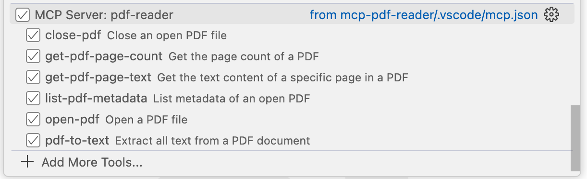
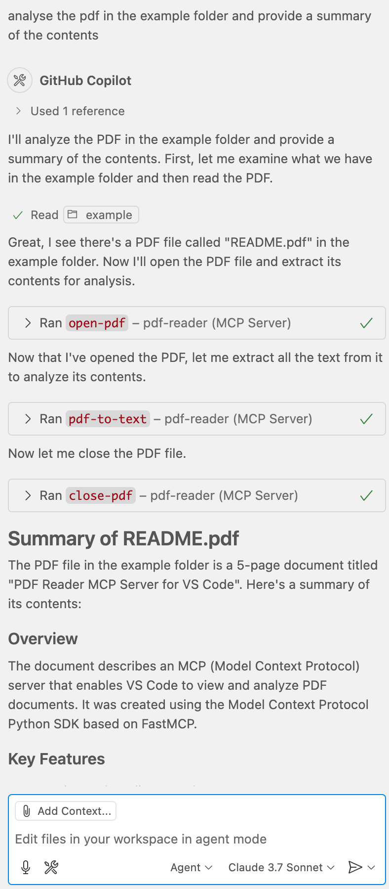

<!-- filepath: ./README.md -->
# PDF Reader MCP Server for VS Code

[](https://opensource.org/licenses/MIT)
[](https://www.python.org/downloads/)

An MCP server that enables VS Code to view and analyze PDF documents using the Model Context Protocol (MCP).

This project was created using the [Model Context Protocol Python SDK](https://github.com/modelcontextprotocol/python-sdk) based on FastMCP.

## Features

- Open and read PDF documents
- Extract text from PDFs (whole document or specific pages)
- View PDF metadata
- Generate summaries of PDF content
- Extract text from specific pages or page ranges
- Analyze PDF content and answer questions about it

## Installation

1. Ensure you have Python 3.13+ installed
2. Clone this repository
3. Create a virtual environment:

```bash
uv venv .venv
source .venv/bin/activate
```

4. Install dependencies:

```bash
uv pip install -e .
```

## Docker

You can also run this MCP server using Docker:

### Build the Docker Image

```bash
docker build -t pdf-reader-mcp .
```

### Run the Container

```bash
docker run --name pdf-reader-mcp -it pdf-reader-mcp
```

### Use with VS Code or Claude Desktop

When using Docker, update your MCP configuration to use the Docker container:

#### VS Code Configuration (Docker)

```json
{
  "servers": {
    "pdf-reader": {
      "type": "stdio",
      "command": "docker",
      "args": [
        "run",
        "--rm", 
        "-i",
        "pdf-reader-mcp"
      ]
    }
  }
}
```

#### Claude Desktop Configuration (Docker)

```json
{
  "mcpServers": {
    "pdf-reader-mcp": {
      "command": "docker",
      "args": [
        "run",
        "--rm", 
        "-i",
        "pdf-reader-mcp"
      ]
    }
  }
}
```

## Usage

This MCP server integrates with VS Code's MCP client to provide PDF reading capabilities. See the Tools and Prompts section below for details on available functionality.

## Examples

### MCP Tools in VS Code Copilot

This image shows the PDF Reader tools available in VS Code through the MCP protocol:



### Example Usage

Here's an example of using the PDF Reader to analyze a document:



## VS Code Configuration

The server is configured to run in VS Code through the `.vscode/mcp.json` file. VS Code must have the MCP extension installed to use this server.

To install the VS Code MCP extension:
1. Open VS Code
2. Go to Extensions (Ctrl+Shift+X or Cmd+Shift+X)
3. Search for "Model Context Protocol"
4. Install the extension from Microsoft

Once the extension is installed, VS Code will be able to communicate with this MCP server according to the configuration in your `.vscode/mcp.json` file. You can use the MCP server through VS Code's Copilot or any other MCP client built into VS Code.

## Development

To make changes to this project:

1. Modify the code in the `src/pdf_reader_mcp` directory
2. Install in development mode: `uv pip install -e .`
3. Test your changes in VS Code

## Requirements

- Python 3.13+
- PyPDF2 3.0.0+
- MCP SDK 1.9.0+ (from [github.com/modelcontextprotocol/python-sdk](https://github.com/modelcontextprotocol/python-sdk))
- VS Code with MCP extension

## Tools and Prompts

### Tools

The server implements the following tools:

- **open-pdf**: Open a PDF file
  - Takes `path` as a required string argument
  - Returns a unique PDF ID for referencing in other operations

- **close-pdf**: Close an open PDF file
  - Takes `pdf_id` as a required string argument
  
- **list-pdf-metadata**: View metadata of an open PDF
  - Takes `pdf_id` as a required string argument
  
- **get-pdf-page-count**: Get the total number of pages in a PDF
  - Takes `pdf_id` as a required string argument

- **get-pdf-page-text**: Get the text content of a specific page in a PDF
  - Takes `pdf_id` as a required string argument
  - Takes `page_number` as a required integer argument (0-based index)

- **pdf-to-text**: Extract all text from a PDF document
  - Takes `pdf_id` as a required string argument
  - Optional `include_page_numbers` as a boolean (default: true)
  - Optional `start_page` and `end_page` as integers to extract a specific range

### Prompts

The server provides the following prompts:

- **summarize-pdf**: Generate a summary of a PDF document
  - Required `pdf_id` argument that identifies the PDF
  - Optional `style` argument to control detail level (brief/detailed)

- **extract-text-from-pdf**: Extract text from specific pages or page ranges
  - Required `pdf_id` argument
  - Optional page or page range arguments (`page`, `start_page`, `end_page`)

- **analyze-pdf**: Analyze a PDF and answer questions about its content
  - Required `pdf_id` argument
  - Required `question` argument specifying what to analyze
  - Optional `page_range` argument to focus on specific pages


## Quickstart

### Install

#### VS Code

Configure VS Code to use the MCP server by editing `.vscode/mcp.json` in your project:

<details>
  <summary>Development Configuration</summary>

```json
{
  "servers": {
    "pdf-reader": {
      "type": "stdio",
      "command": "uv",
      "args": [
        "--directory",
        "${workspaceFolder}",
        "run",
        "python",
        "-c",
        "from pdf_reader_mcp import main; main()"
      ]
    }
  }
}
```
</details>

<details>
  <summary>Published Package Configuration</summary>

```json
{
  "servers": {
    "pdf-reader": {
      "type": "stdio",
      "command": "pdf-reader-mcp"
    }
  }
}
```
</details>

#### Claude Desktop

On MacOS: `~/Library/Application\ Support/Claude/claude_desktop_config.json`
On Windows: `%APPDATA%/Claude/claude_desktop_config.json`

<details>
  <summary>Development/Unpublished Servers Configuration</summary>

```json
{
  "mcpServers": {
    "pdf-reader-mcp": {
      "command": "uv",
      "args": [
        "--directory",
        "${workspaceFolder}",
        "run",
        "pdf-reader-mcp"
      ]
    }
  }
}
```
</details>

<details>
  <summary>Published Servers Configuration</summary>

```json
{
  "mcpServers": {
    "pdf-reader-mcp": {
      "command": "uvx",
      "args": [
        "pdf-reader-mcp"
      ]
    }
  }
}
```
</details>

## Development

### Building and Publishing

To prepare the package for distribution:

1. Sync dependencies and update lockfile:

```bash
uv sync
```

2. Build package distributions:

```bash
uv build
```

This will create source and wheel distributions in the `dist/` directory.

3. Publish to PyPI:

```bash
uv publish
```

Note: You'll need to set PyPI credentials via environment variables or command flags:

- Token: `--token` or `UV_PUBLISH_TOKEN`
- Or username/password: `--username`/`UV_PUBLISH_USERNAME` and `--password`/`UV_PUBLISH_PASSWORD`

### Debugging

Since MCP servers run over stdio, debugging can be challenging. For the best debugging
experience, we strongly recommend using the [MCP Inspector](https://github.com/modelcontextprotocol/inspector).

You can launch the MCP Inspector via [`npm`](https://docs.npmjs.com/downloading-and-installing-node-js-and-npm) with this command:

```bash
npx @modelcontextprotocol/inspector uv --directory "${workspaceFolder}" run pdf-reader-mcp
```

Upon launching, the Inspector will display a URL that you can access in your browser to begin debugging.

## Contributing

1. Fork the repo
2. Create a new branch (`feature-branch`)
3. Commit your changes
4. Push to your branch and submit a PR!

## License

This project is licensed under the **MIT License**.

## Contact

For questions or support, reach out via [GitHub Issues](https://github.com/pietermyb/mcp-pdf-reader/issues).